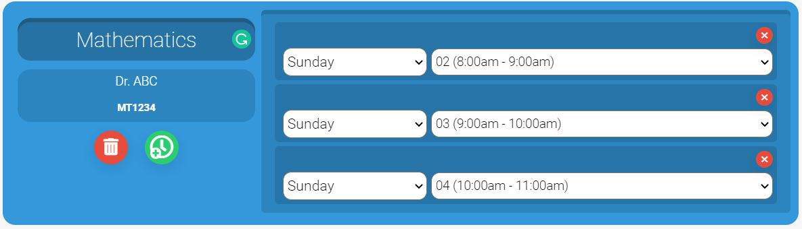

# 📅 UTM Timetable Generator 📅

Manual Timetable Generator specifically for UTM students. However, students from other universities are able to use this timetable generator if applicable.

## Features:

* Manually add courses and sessions. Highly flexible
* Ability to save timetable and its customization settings. Auto load last save whenever you come back
* Clash checking. Notifies user when there is a clash in the timetable
* Stylized and customizable timetable. Set themes, font-sizes, grid sizes, number of columns and so on!
* Downloadable timetable in png format

 
---
 

# 🎓 Tutorial 🎓

If you have a single time slot that spans over 1 hour, simply stack them as follows:

The timetable drawing program will be able to detect consecutive timeslots, and draw them merged

 
 
---

Created using React, Redux, SCSS for styling, react-contenteditable (Library for ContentEditable elements in React), 
and Konva (HTML5 Canvas Library) for drawing the timetable

